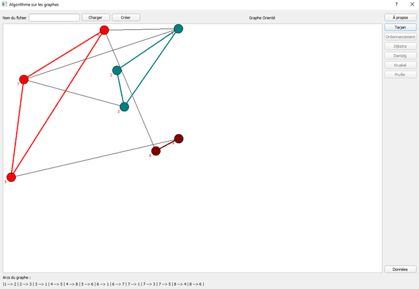
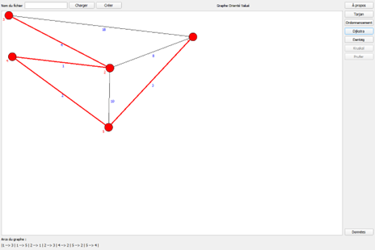
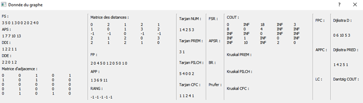

# Algorithmes sur les graphes

## Description

Ce projet est un projet scolaire réalisé dans le cadre de la formation licence informatique à l'université de Haute Alsace. Il a pour but de mettre en pratique les algorithmes de graphes vus en cours. Il est réalisé en C++ avec l'IDE QtCreator.

## Installation

Pour installer le projet, il suffit de cloner le dépôt git et d'ouvrir avec QtCreator le projet `algoGraphe_QT`.

Une version en ligne de commande est également disponible dans le dossier `algoGraphe_CLI`.

## Utilisation

Les algorithmes implémentés sont les suivants :
 - Algorithme de Tarjan : recherche des composantes fortement connexes.

 - Algorithme de Dijkstra : recherche du plus court chemin entre deux sommets.

 - Algorithme de Kruskal : recherche d'un arbre couvrant de poids minimal.

 - Algorithme de Prüfer : recherche du codage de Prüfer d'un arbre.

 - Des données relatives au graphe sont également disponibles.

# /!\ Attention /!\

Il se peut que l'implémentation de certain algorithme ne soit pas correcte. Des fonctionnalités sont manquantes.
L'algorithme d'ordonnancement  ainsi que l'algorithme de Dantzig ne sont pas implémentés. 

## Auteurs

 - GEILLER Valentin, Université de Haute Alsace, L3 Informatique
 - MONNET Paul, Université de Haute Alsace, L3 Miage
 - BOUCHAREB Ilyes, Université de Haute Alsace, L3 Miage