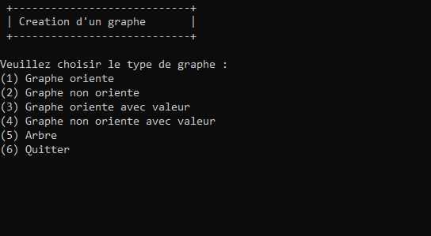

# Algorithmes sur les graphes


## Description

Ce projet est un projet scolaire réalisé dans le cadre de la formation licence informatique à l'université de Haute Alsace. Il a pour but de mettre en pratique les algorithmes de graphes vus en cours. Il est réalisé en C++ avec l'IDE QtCreator.

## Installation

Pour installer le projet, il suffit de cloner le dépôt git et d'ouvrir avec QtCreator le projet `algoGraphe_QT`.

Une version en ligne de commande est également disponible dans le dossier `algoGraphe_CLI`.

## Version en ligne de commande


La création de graphe en ligne de commande est possible. Il suffit de suivre les instructions affichées à l'écran. Le graphe sera sauvegardé dans le fichier `json` à la racine du projet. 



Il sera de sous la forme :

```json
{
    "aps": [4,1,5,9,13],
    "cost": [
        [0,0,0,0,0],
        [0,0,1,1,2],
        [0,1,0,1,2],
        [0,1,1,0,2],
        [0,2,2,2,0]
    ],
    "fs": [32,2,3,4,0,1,3,4,0,1,2,4,0,1,2,3,0,0,0,0,0,0,0,0,0,0,0,0,0,0,0,0,0],
    "isArbre": false,
    "isOriente": false,
    "isValue": true
}
```

Une fois chargé, il est possible d'effectuer les algorithmes suivants :


*Note : Le graphe au format JSON ci-dessus est fait pour être utiliser avec l'algorithme de Kruskal*

Le résultat sera affiché à l'écran :


## Utilisation

###### Vous pouvez lire le fichier [a_lire.txt](a_lire.txt) pour des exemples de graphes

Les algorithmes implémentés sont les suivants :
 - Algorithme de Tarjan : recherche des composantes fortement connexes.


 - Algorithme de Dijkstra : recherche du plus court chemin entre deux sommets.


 - Algorithme de Kruskal : recherche d'un arbre couvrant de poids minimal.


 - Algorithme de Prüfer : recherche du codage de Prüfer d'un arbre.


 - Des données relatives au graphe sont également disponibles.


# /!\ Attention /!\

Il se peut que l'implémentation de certain algorithme ne soit pas correcte. Des fonctionnalités sont manquantes.
L'algorithme d'ordonnancement  ainsi que l'algorithme de Dantzig ne sont pas implémentés. 

## Auteurs

 - GEILLER Valentin, Université de Haute Alsace, L3 Informatique
 - MONNET Paul, Université de Haute Alsace, L3 Miage
 - BOUCHAREB Ilyes, Université de Haute Alsace, L3 Miage
